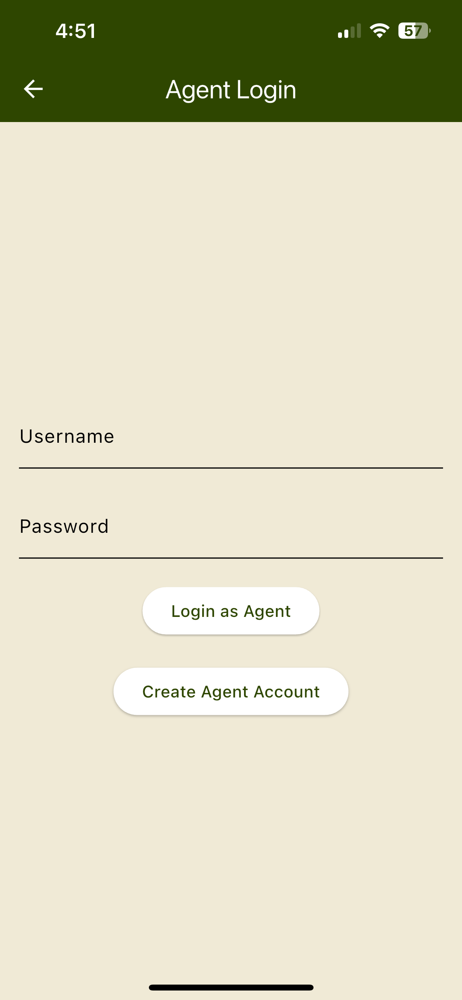

# 🏡 Enhanced Property Search  

**Enhanced Property Search** is a **work-in-progress** AI-powered real estate app built with **Flutter**. The goal is to provide an intuitive home search experience where users can find properties using AI and agent-client integration.  

## 🚀 Planned Features  

🔹 **AI-Based Search** – Upload a photo or describe a home to find similar listings.  
🔹 **Agent-Client System** – Clients must link to an agent for a personalized experience.  
🔹 **Request a Showing** – Schedule property visits via an interactive calendar.  
🔹 **Cross-Platform** – Android & iOS support.  

## 📸 Screenshots  

### Splash Screen  


### Choose Role Screen 


### Agent Login Screen


### Client Login Screen


## 🔧 Getting Started  

### Prerequisites  
- **Flutter SDK** installed ([Get it here](https://flutter.dev/docs/get-started/install))  
- **Dart** installed  
- **Android Studio or VS Code** with Flutter plugin  

### Steps  
1. **Clone the Repository**  
   ```bash
   git clone https://github.com/mandyroskelley/enhanced-property-search.git
   cd enhanced-property-search
